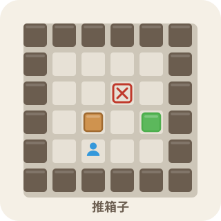

# 推箱子（Sokoban）

<p align="center">
  
</p>

经典推箱子益智游戏：控制小人把所有箱子推到目标点上即可过关。纯前端实现（HTML5 + CSS3 + 原生 JavaScript），无任何依赖，开箱即用。

## ✨ 功能特性

- 🎮 **经典玩法**：网格中推动箱子，全部落位到目标点即过关；玩家、箱子、目标均有独立的图标（小人 / 箱子 / 箱子+❌，SVG 矢量随格子缩放）
- 🗺️ **四页结构**：入口页 → 游戏页 / 查看关卡页 / 制作关卡页，互跳互返
- 🧩 **内置关卡**：8 个由易到难的官方关卡，发布前已用 BFS 求解器校验全部可解
- ↩️ **撤销 / 重置**：逐步撤销与一键重置当前关卡
- 🔢 **关卡导航**：上一关 / 下一关自由切换，并记录每关最佳步数
- 💾 **进度保存**：最佳步数与进度保存在 LocalStorage
- 🌓 **主题切换**：明亮 / 暗黑双主题，与全站一致
- 📱 **全面适配**：响应式布局，桌面方向键 / 移动端滑动操作；手机端自动隐藏实时简图与次要操作，缩短页面
- 🖌️ **制作关卡**：拖拽绘制（连续绘制）、可调行列尺寸、一键清空 / 载入示例、实时简图预览、BFS 可解性验证
- 📂 **自定义关卡**：支持配置化逐关覆盖内置关卡，也可上传本地关卡文件试玩
- 👀 **查看关卡**：官方 / 自制关卡简图卡片，支持试玩、分享、导出、删除，并标注「无解」警告
- 🔍 **关卡搜索**：按关卡名称实时过滤「默认 / 我的」两个区段
- 🔗 **分享与导入**：一键复制分享链接（base64 编码），好友打开即自动导入
- 📤 **关卡导出**：每张卡片可导出为 JSON（含名称与地图）或 TXT（纯字符画）
- 💬 **评论系统**：四页均接入站点统一评论抽屉（悬浮按钮）

## 📄 页面说明

| 页面 | 文件 | 说明 |
|------|------|------|
| 入口页 | `index.html` | 「开始游戏 / 查看关卡 / 制作关卡」三入口卡片 |
| 游戏页 | `game.html` | 闯关、撤销 / 重置、上一关 / 下一关、上传试玩、胜负结算 |
| 查看关卡 | `levels.html` | 简图卡片：试玩 / 分享 / 导出 / 删除，上传导入、搜索 |
| 制作关卡 | `editor.html` | 拖拽绘制棋盘，验证可解后保存 / 试玩 |

## 🕹 操作指南

| 平台 | 操作 |
|------|------|
| 桌面端 | 方向键 或 WASD 移动；Z 撤销 |
| 移动端 | 在棋盘上滑动移动 |
| 制作关卡 | 鼠标 / 手指按住拖动连续绘制；工具栏切换画笔（墙 / 地板 / 目标 / 箱子 / 玩家 / 橡皮） |

## 📁 项目结构

```
sokoban/
├── index.html           # 入口页
├── game.html            # 游戏页
├── levels.html          # 查看关卡页
├── editor.html          # 制作关卡页
├── config/
│   └── sokoban-levels.json  # 内置关卡（可配置逐关覆盖）
├── css/
│   ├── home.css         # 入口页样式
│   ├── style.css        # 游戏页样式（含明暗主题变量、SVG mask 图标）
│   ├── levels.css       # 查看关卡页样式
│   └── editor.css       # 制作关卡页样式
├── js/
│   ├── game.js          # 游戏核心（移动 / 推箱 / 撤销 / 胜负 / 控制栏）
│   ├── levels.js        # 关卡数据加载与解析（JSON / 字符画）
│   ├── solver.js        # BFS 可解性求解器
│   ├── map.js           # 共享简图渲染（mini-map）
│   ├── storage.js       # 本地存储（最佳步数 / 进度）
│   ├── userlevels.js    # 用户关卡 CRUD + base64 分享码 + 导出
│   ├── viewer.js        # 查看关卡页逻辑（卡片 / 搜索 / 缓存）
│   ├── editor.js        # 制作关卡页逻辑（绘制 / 验证 / 保存）
│   └── home.js          # 入口页跳转
└── README.md
```

## 🧩 关卡字符约定

关卡以 ASCII 地图描述：

| 字符 | 含义 |
|------|------|
| `#` | 墙 |
| `(空格)` | 地板 |
| `.` | 目标点 |
| `$` | 箱子 |
| `*` | 箱子已在目标点上 |
| `@` | 玩家 |
| `+` | 玩家站在目标点上 |

内置关卡与用户自建关卡均经过 BFS 求解器校验可解，避免死局。

## 📂 自定义关卡

### 1. 配置化（逐关覆盖）

在 `sokoban/config/sokoban-levels.json` 中只写需要调整的关卡，按索引**逐关覆盖**内置对应关卡，未列出的保留默认：

```json
{
  "levels": [
    { "name": "我的第1关", "map": ["####", "#@ #", "#$ #", "# .#", "####"] },
    { "name": "我的第2关", "map": ["####", "#@ #", "####"] }
  ]
}
```

> 仅覆盖第 1、2 关，其余 6 关沿用内置。数组长度超出内置范围的项会被忽略（新增关卡请走「制作关卡」或「上传试玩」）。

### 2. 制作关卡

进入「制作关卡」页拖拽绘制：工具栏选择元素（墙 / 地板 / 目标 / 箱子 / 玩家 / 橡皮），在画布上按住拖动连续绘制；可调整行列尺寸、一键清空或载入示例。绘制完成后点「验证可解」由 BFS 求解器校验，通过后「保存」到「我的关卡」或直接「试玩」。

### 3. 上传试玩

游戏页或查看关卡页点「**上传关卡**」，选择本地文件即可在浏览器内试玩，不影响内置进度与最佳记录；试玩时关卡名显示为「`自定义 · 关卡名`」，用顶部返回箭头回到来源页。

支持两种文件格式（自动识别）：

- **JSON**
  - 单关：`{ "name": "关名", "map": ["行1", "行2", ...] }`
  - 多关：`{ "levels": [ { "name": "关1", "map": [...] }, ... ] }`
- **纯文本字符画**：每行一行 ASCII 地图（同上方字符约定）

> 解析时非法字符会过滤为地板（空格），不等长的行会右侧补空格对齐，容错试玩。

## 🔗 分享与导入

- **分享**：查看关卡页任意卡片点「分享」，将关卡 base64 编码为 `editor.html?import=...` 链接并复制到剪贴板。
- **导入**：好友打开该链接即自动导入到「我的关卡」；也可在查看关卡页粘贴分享码 / 链接点「导入分享」。
